# Overview

Relevant is a Windows-based machine that demonstrates a full attack chain including SMB enumeration, credential discovery, web shell upload, and privilege escalation through abuse of SeImpersonatePrivilege using PrintSpoofer.
This machine highlights how misconfigured SMB shares and IIS servers can lead to complete system compromise.

# Enumeration

The first step was to scan the target machine using Nmap.

`nmap -sC -sV 10.112.169.235`

The scan revealed several open ports on the target machine. Port 80 was running Microsoft IIS 10.0, indicating a web server that could potentially be used as an entry point. Ports 135 and 139 were related to RPC and NetBIOS services, which are commonly present in Windows environments. Port 445 exposed the SMB service, making it a promising target for further enumeration. Finally, port 3389 was open, indicating that Remote Desktop Protocol (RDP) was enabled on the system.

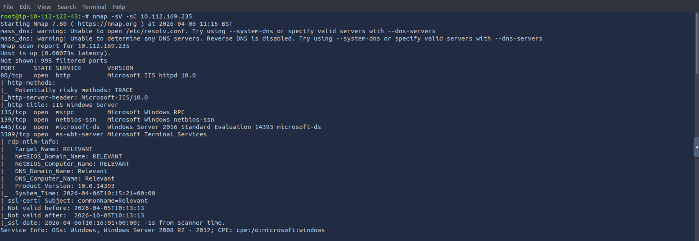

# Credential Discovery and SMB Enumeration

Next, SMB shares were enumerated. Because we added -N to the end, we can see it without being asked for a password. I came across an interesting file named nt4wrksv, and when I looked inside, I found a file called passwords.txt.

`smbclient -L  //10.112.169.235 -N`

`smbclient -L  //10.112.169.235/nt4wrksv -N`

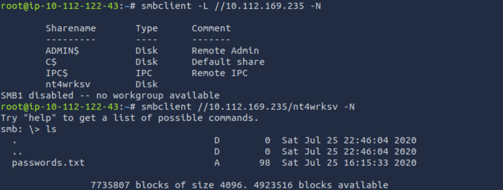

`get passwords.txt`

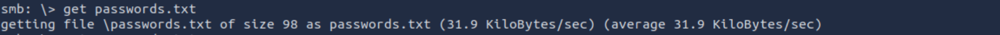

The passwords.txt file contained Base64 encoded credentials.

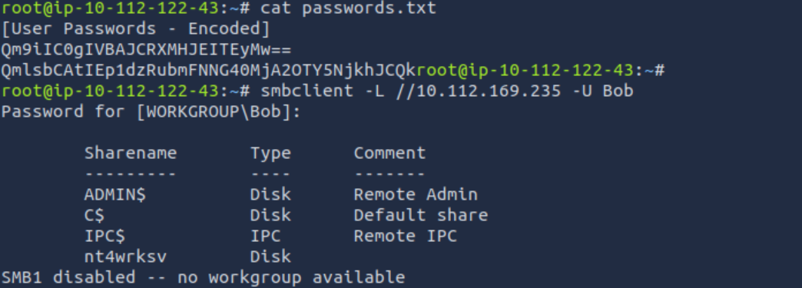

This revealed credentials for the SMB users.

`Bob - !P@$$W0rD!123`

`Bill - Juw4nnaM4n420696969!$$$`

# Identifying Writable Share

Since we had write access to the SMB share, a test file was uploaded.

`put test.txt`

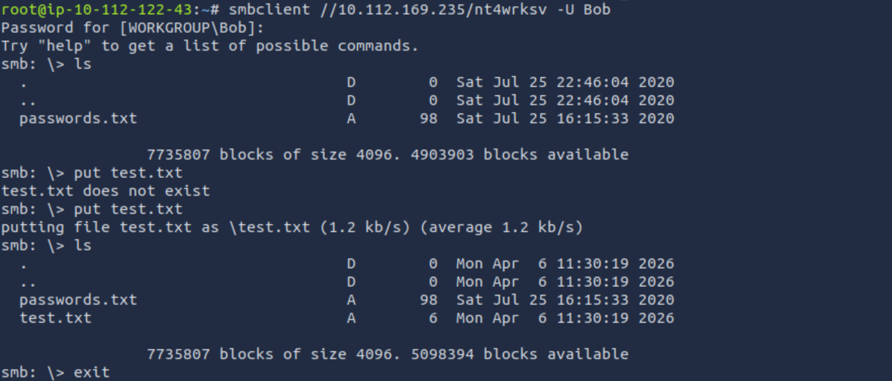

Then the file was accessed via the web server:

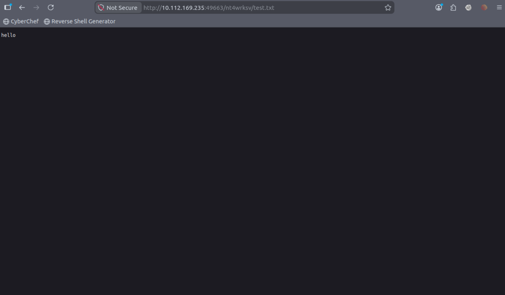

Further investigation revealed that port 49663 was also hosting an HTTP service. When accessing the server through this port, it became clear that the `nt4wrksv` SMB share was mapped to the IIS web directory. This meant that files uploaded through SMB could be accessed via the web server, allowing the upload and execution of a web shell.

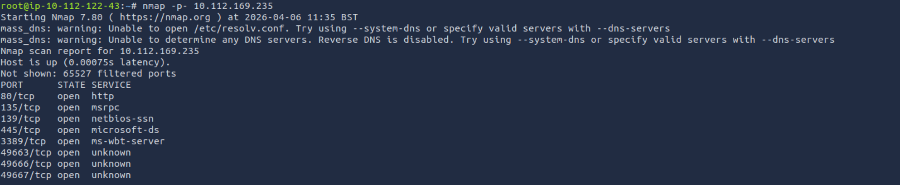

# Initial Access (Web Shell)

Because the share was writable and exposed through the web server, an ASP web shell was uploaded.

We download cmd.aspx using wget.

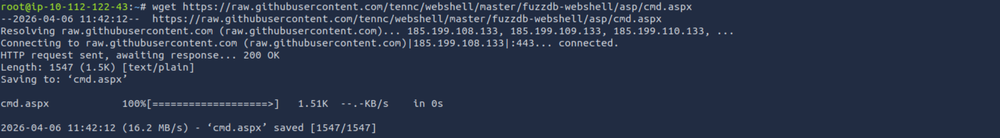

Then, just like we placed the test.txt file in the SMB access settings, we also place the cmd.aspx file there.!

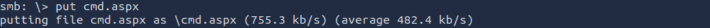

Then accessed in the browser:

`http://10.112.169.235:49663/nt4wrksv/cmd.aspx`

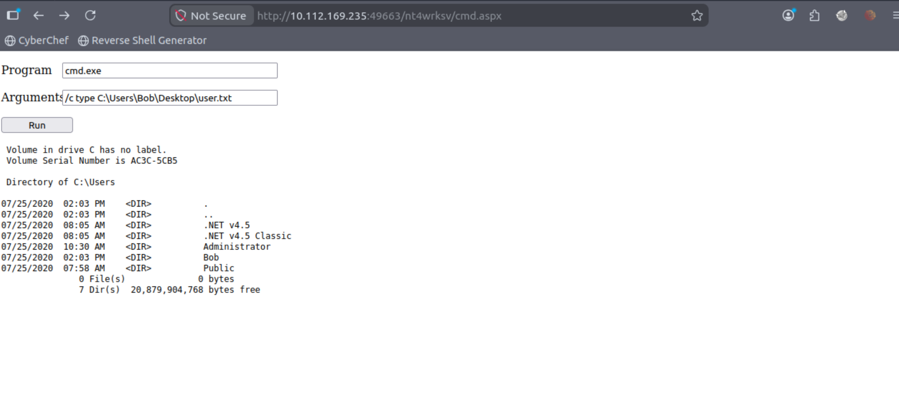

Example command:

`whoami`

# Privilege Enumeration

After achieving command execution through the uploaded web shell, the next step was to enumerate the system for potential user accounts. The `C:\Users` directory was inspected to identify existing users on the machine, which revealed the accounts Bob and Administrator. Since user flags are typically stored on a user's Desktop, the enumeration continued by checking the contents of `C:\Users\Bob\Desktop`. This revealed a file named `user.txt`. The contents of this file were then displayed, allowing retrieval of the user flag.

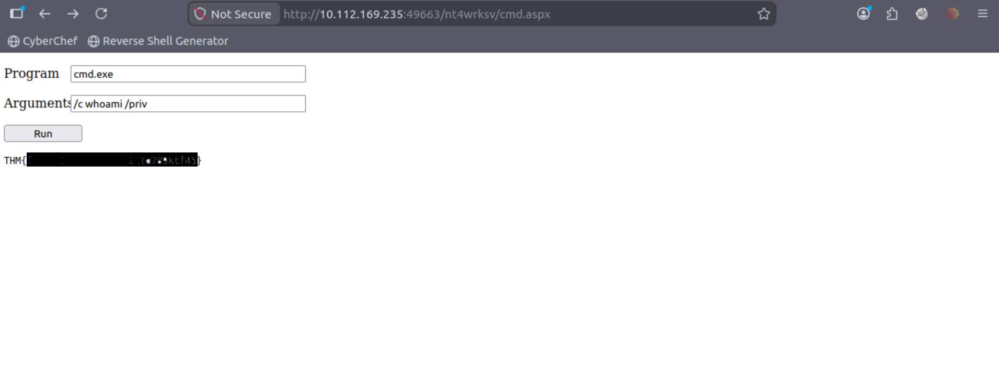

Running the following command revealed available privileges.

`whoami /priv`

Output showed:

`SeImpersonatePrivilege    Enabled`

This privilege is commonly abused for privilege escalation.

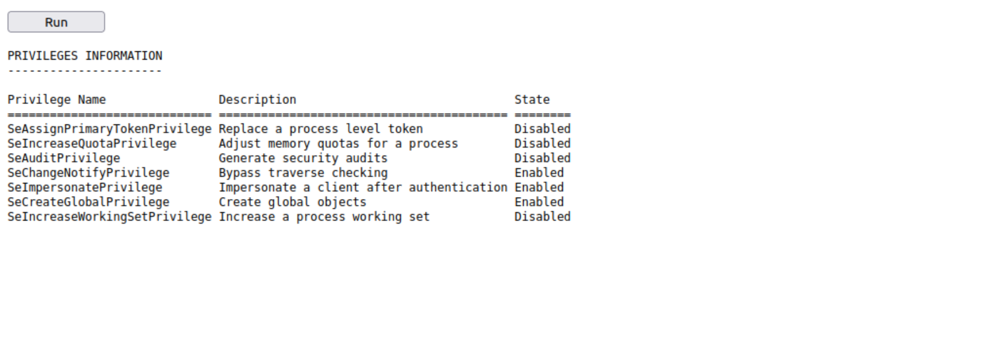

# Privilege Escalation - PrintSpoofer

The PrintSpoofer vulnerability was exploited, downloaded, and uploaded to the server via an SMB share.

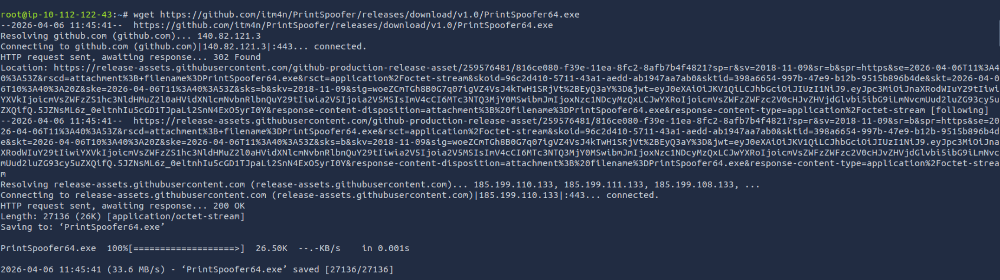

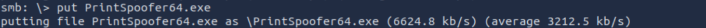

The exploit was executed using the web shell.

Example command:

`PrintSpoofer64.exe -i -c cmd`

This abuses SeImpersonatePrivilege to spawn a SYSTEM shell.

# Root Flag

To obtain the root flag, the previously uploaded `PrintSpoofer64.exe` exploit was executed through the web shell to abuse the `SeImpersonatePrivilege`. Instead of spawning an interactive shell, the exploit was used to execute a command that read the root flag and redirected its contents into a file located in the web-accessible directory. The command accessed `C:\Users\Administrator\Desktop\root.txt` and wrote the output to `C:\inetpub\wwwroot\nt4wrksv\root.txt`. Because this directory was served by the IIS web server, the file could be accessed directly through the browser on port 49663. Opening this file revealed the root flag, confirming full system compromise.

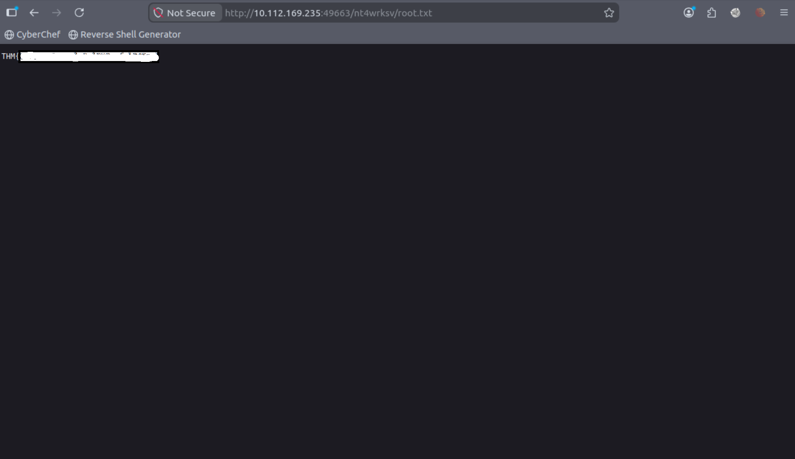